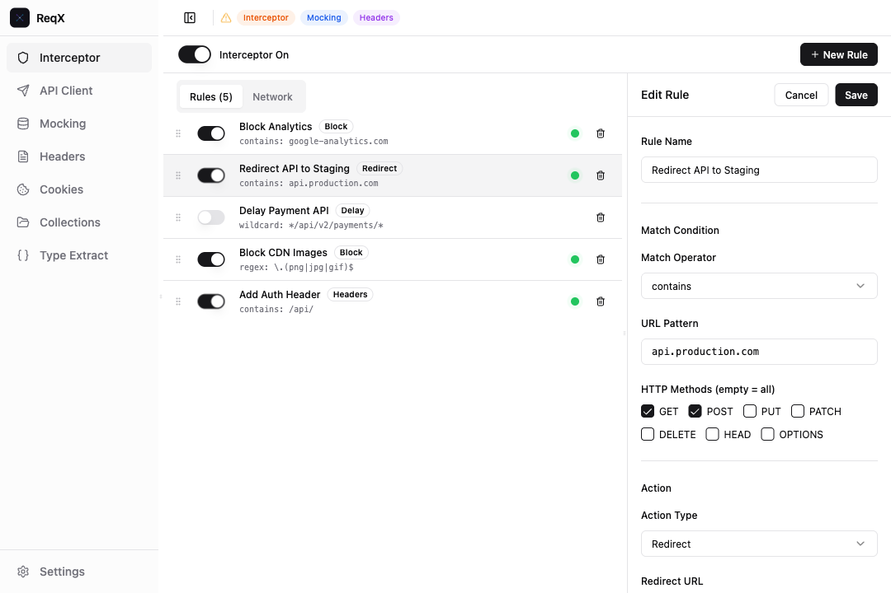
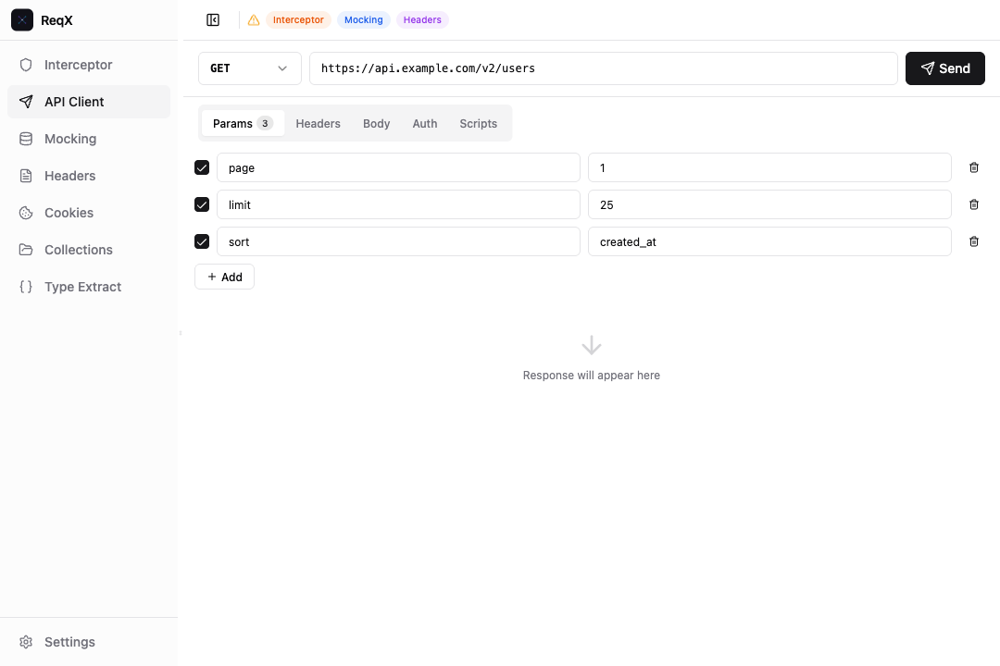
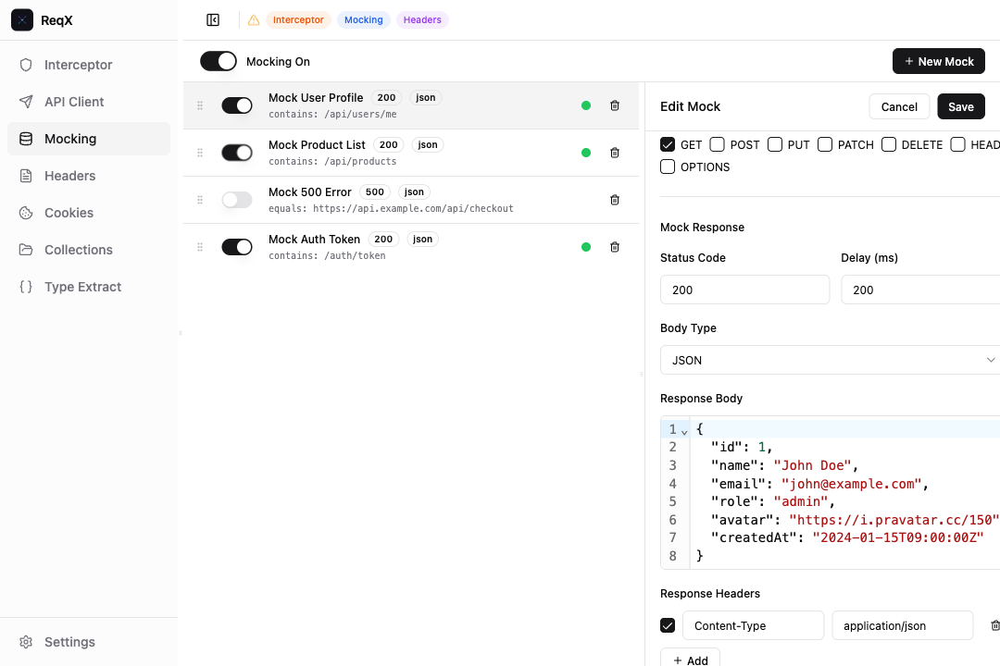
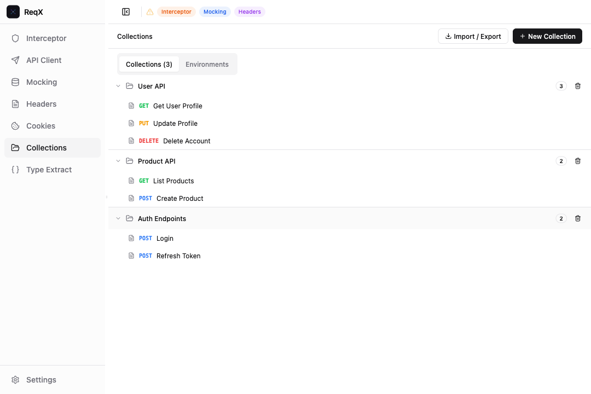
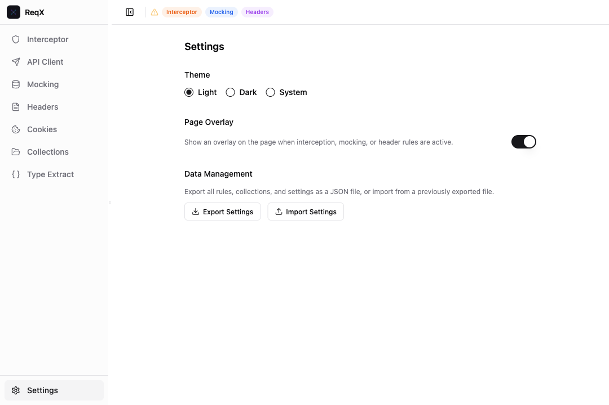

<p align="center">
  
</p>

<h1 align="center">
  ReqX
</h1>

<p align="center">
  <strong>Exchange your requests</strong>
</p>

<p align="center">
  All-in-one developer toolkit for Chrome DevTools.<br/>
  Intercept, mock, test, and debug HTTP requests — without leaving the browser.
</p>

<p align="center">
  
  
  
</p>

<p align="center">
  <a href="./README.md">English</a> · <a href="./README.ko.md">한국어</a>
</p>

---

## Why ReqX?

When developing frontend applications, you constantly need to:

- Block or redirect API requests to test error handling
- Mock server responses before the backend is ready
- Send HTTP requests without switching to Postman or another tool
- Override request/response headers for debugging
- Manage cookies across different domains
- Convert JSON responses into TypeScript types

These tasks typically require switching between multiple tools. **ReqX brings them all into one DevTools panel**, so you can stay in context and move faster.

---

## Installation

### Download (Recommended)

1. Go to the [Releases](https://github.com/flowerjun/interceptly/releases) page
2. Download the latest `reqx-v*.zip` file
3. Unzip the file
4. Navigate to `chrome://extensions`
5. Enable **Developer mode** (top right toggle)
6. Click **Load unpacked**
7. Select the unzipped `ReqX/` folder

### Build from Source

```bash
pnpm install
pnpm build
```

Then load the `ReqX/` folder in `chrome://extensions` as described above.

### Open in DevTools

1. Visit any website (e.g. `https://jsonplaceholder.typicode.com`)
2. Open DevTools (`F12` or `Cmd + Option + I`)
3. Click the **ReqX** tab at the top of DevTools

---

## Features

### Interceptor - Block, Delay, Redirect Requests



Create rules to control how HTTP requests behave:

- **Block** - Prevent requests from reaching the server. Useful for testing offline scenarios or error boundaries.
- **Delay** - Add artificial latency (in ms) to simulate slow networks.
- **Redirect** - Reroute requests to a different URL. With **Preserve Path** enabled, only the matched portion is replaced (e.g. `dev.api.com` -> `staging.api.com` while keeping the full path and query string).
- **Modify Headers** - Add, remove, or change request/response headers on the fly.

**URL matching** supports `contains`, `equals`, `regex`, and `wildcard` operators. You can also filter by HTTP method.

Each rule has its own toggle, plus a global on/off switch for the entire interceptor.

### API Client - Send Requests Without Leaving DevTools



A built-in HTTP client similar to Postman:

- **All HTTP methods**: GET, POST, PUT, PATCH, DELETE, HEAD, OPTIONS
- **Query params**: Key-value editor with auto-detection from pasted URLs
- **Headers**: Custom request headers with enable/disable toggles
- **Body**: JSON (with syntax highlighting), Form Data, Raw text, Binary file upload
- **Auth**: Bearer Token, Basic Auth, API Key
- **Scripts**: Pre-request and post-response JavaScript execution
- **Response viewer**: Status, duration, size, formatted body, and response headers

Runs through the extension's service worker, so **there are no CORS restrictions**.

### Mocking - Fake API Responses


Return custom responses without a real server:



- Set **status code**, **delay**, **body type** (JSON / Text / HTML), and **response headers**
- Mock rules are evaluated **before** intercept rules
- Works at the network level via Chrome DevTools Protocol, so it affects all network requests (XHR, fetch, scripts, images)

Perfect for frontend development when the backend isn't ready, or for reproducing specific server responses.

### Headers - Override Request & Response Headers

Create dedicated rules to automatically modify headers for matching URLs:

- **Set**: Add or overwrite a header value
- **Remove**: Strip a header entirely
- **Append**: Add to an existing header value
- Supports both **request** and **response** headers
- Multiple modifications per rule

Useful for injecting auth tokens, adding debug headers, removing cookies, or setting cache policies.

### Cookies - View and Manage Browser Cookies

- Browse all cookies with search and domain filtering
- **Auto-filter by current tab domain** for quick access
- Create, edit, and delete cookies
- View cookie flags: Secure, HttpOnly, Session, SameSite
- Clear all cookies for a specific domain

### Collections - Save and Organize API Requests



- Save API Client requests into named collections (folders)
- **Environments**: Define variables like `{{BASE_URL}}` and switch between Development / Staging / Production
- **Import / Export**: Share collections as JSON files

### Type Extractor - JSON to TypeScript


Paste any JSON and get TypeScript interfaces instantly:

- Real-time conversion as you type
- Customizable root interface name
- Handles nested objects, arrays, union types, and nullable fields
- One-click copy to clipboard
- Resizable split pane for comfortable editing

### Settings



- **Theme**: Light, Dark, or System (auto-detects OS preference)
- **Page Overlay**: Show/hide the in-page overlay when rules are active
- **Export / Import**: Back up and restore all rules, collections, and settings

### Real-time Notifications

When rules are active, ReqX keeps you informed:

- **Active indicator**: A pulsing dot appears next to each active rule in the list
- **Page overlay**: Individual badges for each active feature (Interceptor, Mocking, Headers) with toast notifications when rules match
- **Browser badge**: The extension icon shows the number of active features
- **DevTools header**: Warning indicators in the panel header when features are enabled

---

## License

This project is licensed under the [MIT License](./LICENSE).

---

<p align="center">
  Made by <a href="https://github.com/flowerjun">flowerjun</a>
</p>
